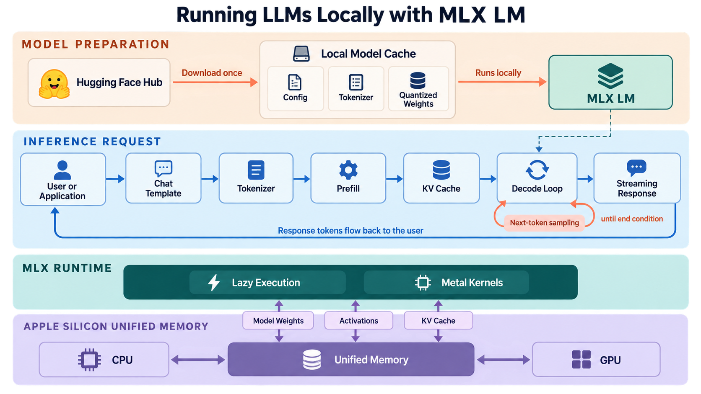

# Local LLMs with MLX

WIP...

This repository provides a hands-on introduction to running large language models locally on Apple silicon with [MLX](https://github.com/ml-explore/mlx) and [MLX LM](https://github.com/ml-explore/mlx-lm). It covers a range of topics, from getting started with local inference to understanding and optimizing model performance.

MLX is an array framework designed for machine learning on Apple silicon. MLX LM builds on that foundation with tools for loading, generating, fine-tuning, and serving large language models. Together, they make it possible to run capable language models directly on a Mac while taking advantage of its CPU, GPU, and unified-memory architecture.

The material in this repository connects hands-on examples with the underlying system behavior. It examines how models are obtained and loaded, how prompts become tokens, how prefill and autoregressive decoding produce a response, and how model configuration affects latency, throughput, and memory consumption. It also considers the practical concerns involved in turning a local experiment into a reusable application or service.

The focus is educational and measurement-driven. Examples are designed to make individual stages of inference visible, establish meaningful performance baselines, and help explain why a particular optimization changes speed, memory use, or output quality. Offline operation is also treated as an important capability: after the required model artifacts are downloaded, inference can remain on the local machine without sending prompts to a remote model provider.

## Tutorials

| Tutorial | Article | Code |
| --- | --- | --- |
| **Why MLX for Local LLMs?** | [Read the tutorial](https://theaiops.substack.com/p/why-mlx-for-local-llms) | — |

## License

This tutorial is licensed under the [Creative Commons Attribution-NonCommercial-ShareAlike 4.0 International License](LICENSE.md).
